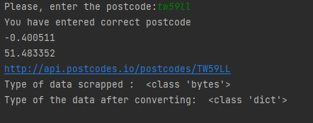

# What is Restful API?
- A REST API (also known as RESTful API) is an application programming interface (API or web API) that conforms to the constraints of REST architectural style and allows for interaction with RESTful web services. REST stands for representational state transfer and was created by computer scientist Roy Fielding.


# Why Python is a good language for developing Rest  API
- The clear, simple syntax of Python makes it an ideal language to interact with REST API
- There’s a library made specifically to provide that functionality: Requests.
- Python Requests is a powerful tool that provides the simple elegance of Python to make HTTP requests to any API in the world. 
# Benefits of using Rest APIs
- REST APIs are flexible. They can handle many types of requests and send data in many different formats.
- REST APIs are scalable. They are designed for communication between any two pieces of software, regardless of size or capability. As a web application grows and adds more resources, its REST API will be able to quickly handle the increasing amount and variety of requests.
- REST APIs incorporate existing web technologies, making them relatively easy to build and use. To request a resource via a REST API, you just need to provide its URL.
# What is a Rest API call?
- Data (such as images, videos, and text) embody resources in REST. A client visits a specific URL and sends a server request to receive a response.

# What are API- Get ,PuT,Post & Delete calls?
- POST request to create records
- GET request to read or get a resource (a document or image, a collection of other resources) from the server
- PUT and PATCH requests to update records
- DELETE request to delete a resource from a server

# Create the class with all the functions mentioned below.
- Create a function that checks if the post code is valid
- Display latitude
- Display longitude
- Display URL
- Convert the data type of data scrapped from web
```python
import requests


class Api:

    def __init__(self, postcode):
        self.url = "http://api.postcodes.io/postcodes/"
        self.postcode = postcode

    def post_code_checker(self):  # Creating a function that checks if the post code is valid
        url_arg = self.url + self.postcode
        response = requests.get(url_arg)

        if response.status_code == 200:
            print("You have entered correct postcode")
        else:
            print("Please enter the correct postcode in right format")

    def latitude(self):  # display latitude
        url_arg = self.url + self.postcode
        response = requests.get(url_arg)
        response_dict = response.json()
        result = response_dict["result"]
        latitude = result["latitude"]
        return latitude

    def longitude(self):  # display longitude
        url_arg = self.url + self.postcode
        response = requests.get(url_arg)
        response_dict = response.json()
        result = response_dict["result"]
        longitude = result["longitude"]
        return longitude

    def display_url(self):  # display url together with given postcode
        url_arg = self.url + self.postcode
        return url_arg

    def data(self):
        url_arg = self.url + self.postcode
        print(url_arg)  # display url together with given postcode
        response = requests.get(url_arg)
        print("Type of data scrapped : ",
              type(response.content))  # check the type of data scrapped from the web - response

        response_dict = response.json()  # converting data type to dictionary
        print("Type of the data after converting: ", type(response.json()))

```
# Create a file called postcode_checker.py 
- import post_code.py and class Api
- call the functions in postcode_check.py
```python
from post_code import Api

postcode = input("Please, enter the postcode:").upper().strip()  # prompt the user to input the postcode
a = Api(postcode)
a.post_code_checker()
print(a.longitude())
print(a.latitude())
a.data()
```
# Output of the program:


